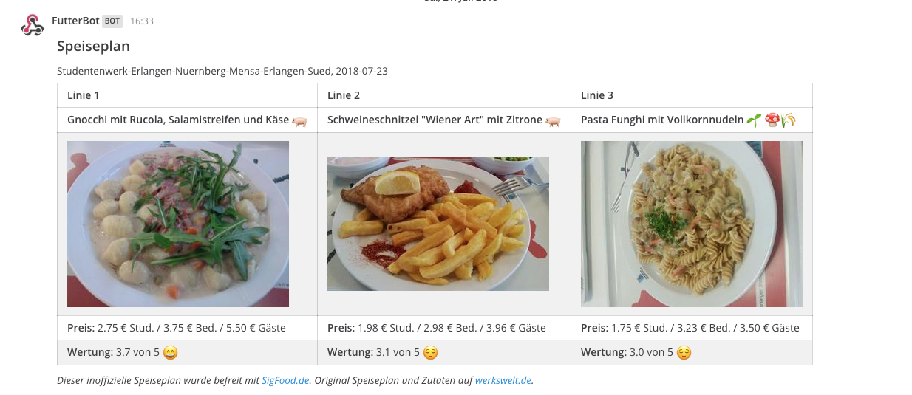

# SigFood-Mattermost

Integration des Speiseplans der Südmensa in eine Mattermost-Installation

Mit Hilfe der API von SigFood wird der Tagesspeiseplan der Mensa Süd der FAU 
ausgelesen und mit Hilfe dieses SKripts an ein Mattermost-Webhook gesandt.

## Beispielausgabe

## Requirements

* PHP
* PHP-curl

## Installation und Konfiguration

1. Erstellen eines Webhooks im Mattermost
   (Integration -> Eingehende Webhooks)

   Hier den Webhook beschreiben und die dann erzeugte URL kopieren.
   Falls man keine Webhooks anlegen kann bzw. in dem Kontextmenü kein Punkt
   "Integration" findet, muss man den Admin der Installation fragen :smiley:

2. PHP-Skript mit einem Editor öffnen

   Im $CONST()-Array die erstellte Webhook-URL einstellen.

   Alle weitere EInstellungen sind selbsterklärend.

3. Skript speichern und entweder manuell auf der Console testen
     php get-tagesplan.php

   Sollte alles korrekt eingestellt sein, sollte nun im 
   Markplatz Channel des Teams in dem der eingehende Webhook erstellt wurde
   der aktuelle Speiseplan angezeigt werden.

   Damit es automatisch aufgerufen wird, ist -abhängig vom jeweiligen System-
   ein Crontab oder Taskmanagereintrag zu machen.

## Hinweise

Das Skript sendet bei jedem Aufruf den entsprechenden Speiseplan an Mattermost.
Es findet keine Prüfung danach statt, ob es bereits zuvor gesendet hat. 
Daher sollte man das Skript bei einem Croneintrag so einstellen, das es auch nur 
einmal pro (Wochen)Tag aufgerufgen wird.

## Autor

Wolfgang Wiese ( [xwolf](https://www.xwolf.de) )

## Thanks 

Danke an Michael Meier für die Bereitstelklung von [SigFood.de](https://www.sigfood.de)

## Copyright

GNU General Public License (GPL) Version 2

